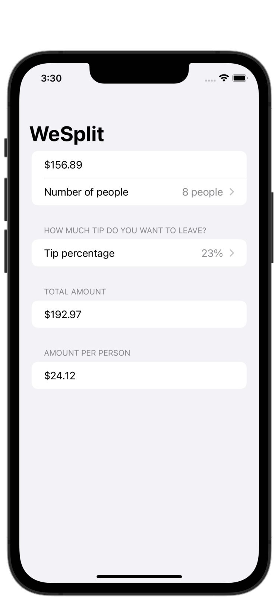
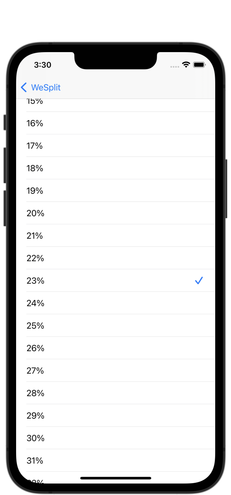

#  Project 1 - WeSplit

[Day 16 - WeSplit Overview](https://www.hackingwithswift.com/100/swiftui/16)

[Day 17 - WeSplit Implementation](https://www.hackingwithswift.com/100/swiftui/17)

[Day 18 - WeSplit Wrap Up and Review](https://www.hackingwithswift.com/100/swiftui/18)

## Topics

* Form
* NavigationView
* @State
* Section
* Picker
* TextField
* ForEach

## Challenges

1. Add a header to the third section, saying "Amount per person."
2. Add another section showing the total amount for the check - i.e., the original amount plus tip value, without dividing by the number of people.
3. Change the tip percentage picker to show a new screen rather than using a segmented control, and give it a wider range of options - everything from 0% to 100%. Tip: use the range `0..<101` for your range rather than a fixed array. 

## Screenshots

### Base app

    
    

### Challenges

    
    

