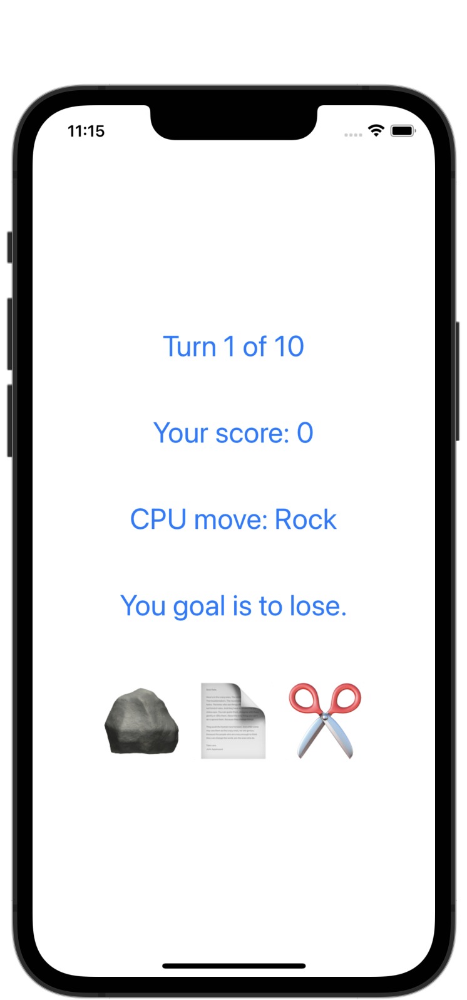

#  Milestone: Projects 1-3

[Day 25 - Milestone: Projects 1-3](https://www.hackingwithswift.com/100/swiftui/25)

## Topics

Review of topics presented so far.

## Challenges

### Rock Paper Scissors Brain Game

* Each turn of the game the app will randomly pick either rock, paper, or scissors.
* Each turn the app will alternate between prompting the player to win or lose.
* The player must then tap the correct move to win or lose the game.
* If they are correct they score a point; otherwise they lose a point.
* The game ends after 10 questions, at which point their score is shown.

## Screenshots

### Challenge: Rock Paper Scissors Brain Game

*Note: this is still an early, simple-looking version. I hope to make it look prettier in the future.

    

