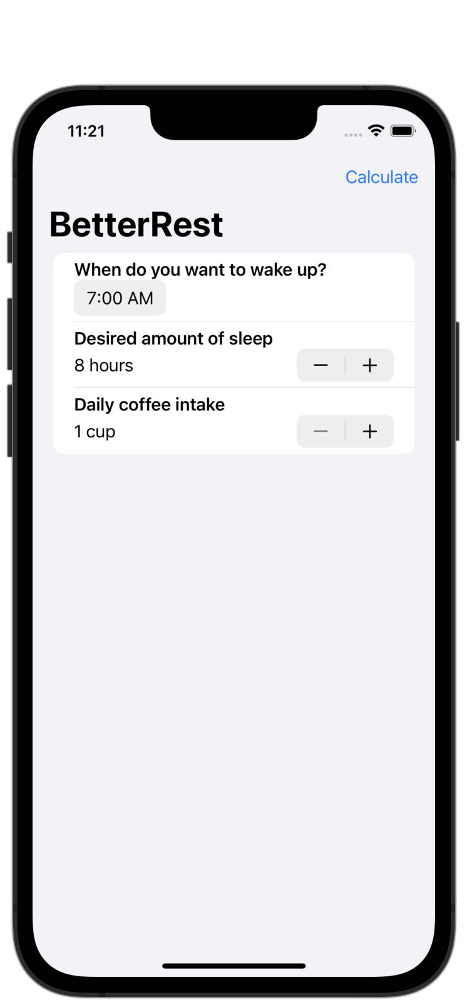

#  Project 4 - BetterRest

[Day 26 - BetterRest Part One](https://www.hackingwithswift.com/100/swiftui/26)

[Day 27 - BetterRest Part Two](https://www.hackingwithswift.com/100/swiftui/27)

[Day 28 - BetterRest Part Three](https://www.hackingwithswift.com/100/swiftui/28)

## Topics

* Stepper
* DatePicker
* Date, Calendar, DateComponents
* Create ML, Core ML

## Challenges

Challenges will go here when I get to them!

## Screenshots

### Base app

    
    

### Challenges

Challenge screenshots will go here once I have completed them!

<!--
-->
<!--    -->
<!--    -->
<!--    -->
<!--
-->
