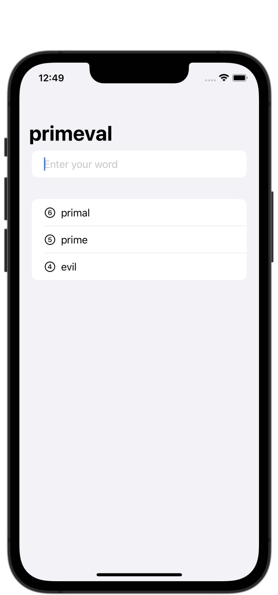

#  Project 5 - WordScramble

[Day 29 - WordScramble Part One](https://www.hackingwithswift.com/100/swiftui/29)

[Day 30 - WordScramble Part Two](https://www.hackingwithswift.com/100/swiftui/30)

[Day 31 - WordScramble Part Three](https://www.hackingwithswift.com/100/swiftui/31)

## Topics

* List
* UITextChecker
* onAppear()
* Bundle
* fatalError()
* More practice with @State, NavigationView

## Challenges

Challenges will go here when I get to them!

## Screenshots

### Base app

    
    

### Challenges

<!--
-->
<!--    -->
<!--    -->
<!--
-->
