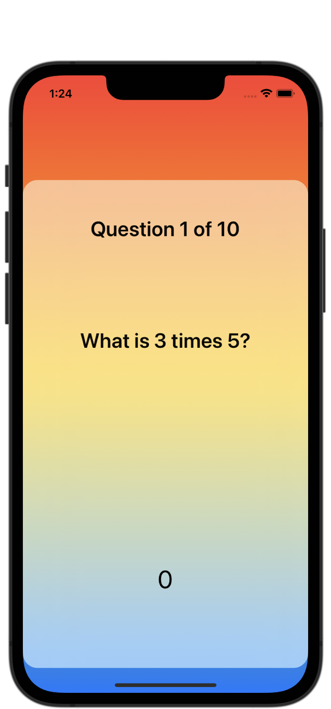

#  Milestone: Projects 4-6

[Day 35 - Milestone: Projects 4-6](https://www.hackingwithswift.com/100/swiftui/35)

## Topics

Review of topics presented so far.

## Challenges

1. Start with an App template, then add some state to determine whether the game is active or whether you’re asking for settings.
2. Generate a range of questions based on the user’s settings.
3. Show the player how many questions they got correct at the end of the game, then offer to let them play again.

## Screenshots

### Base app

    
    

### Modifications

None so far.
