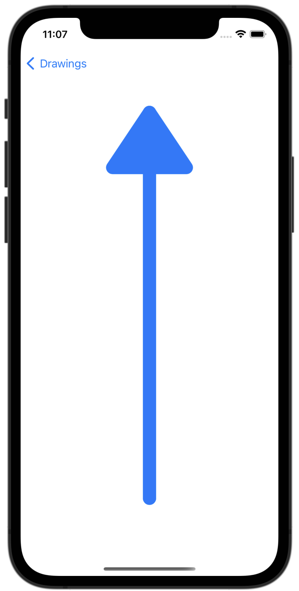

#  Project 9 - Drawing

[Day 43 - Drawing Part One](https://www.hackingwithswift.com/100/swiftui/43)

[Day 44 - Drawing Part Two](https://www.hackingwithswift.com/100/swiftui/44)

[Day 45 - Drawing Part Three](https://www.hackingwithswift.com/100/swiftui/45)

[Day 46 - Drawing Part Four](https://www.hackingwithswift.com/100/swiftui/46)

## Topics

* Paths, shapes, insettable shapes
* CGAffineTransform
* ImagePaint
* drawingGroup()
* Blend modes
* animatableData
* AnimatablePair

## Challenges

Challenges will go here eventually, if there are any for this project.

## Screenshots

### Base app

Screenshots will go here eventually.

<!--
-->
<!--    -->
<!--
-->

### Challenges

Screenshots will go here eventually.
