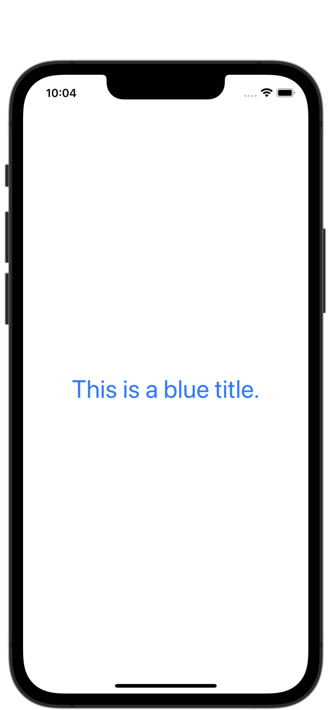

#  Project 3 - Views and Modifiers

[Day 23 - Views and Modifiers Overview](https://www.hackingwithswift.com/100/swiftui/23)

[Day 24 - Views and Modifiers Wrap Up and Review](https://www.hackingwithswift.com/100/swiftui/24)

## Topics

* Why does SwiftUI use structs for views?
* What is behind the main SwiftUI view?
* Why modifier order matters
* Why does SwiftUI use `some View` for its view type?
* Conditional modifiers
* Environment modifiers
* Views as properties
* View composition
* Custom modifiers
* Custom containers

## Challenges

1. Go back to project 1 and use a conditional modifier to change the total amount text view to red if the user selects a 0% tip.
2. Go back to project 2 and replace the `Image` view used for flags with a new `FlagImage()` view that renders one flag image using the specific set of modifiers we had.
3. Create a custom ViewModifier (and accompanying View extension) that makes a view have a large, blue font suitable for prominent titles in a view.

## Screenshots

### Challenge 1: WeSplit modification

<p float="left">
    
</p>

### Challenge 2: Guess the Flag modification

Code snippet from implementing the `FlagImage()` view:

```swift
struct FlagImage: View {
    var country: String
    
    var body: some View {
        Image(country)
            .renderingMode(.original)
            .clipShape(Capsule())
            .shadow(radius: 5)
    }
}
```

### Challenge 3: Custom ViewModifier

<p float="left">
    
</p>


