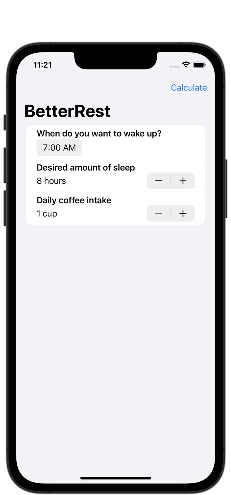
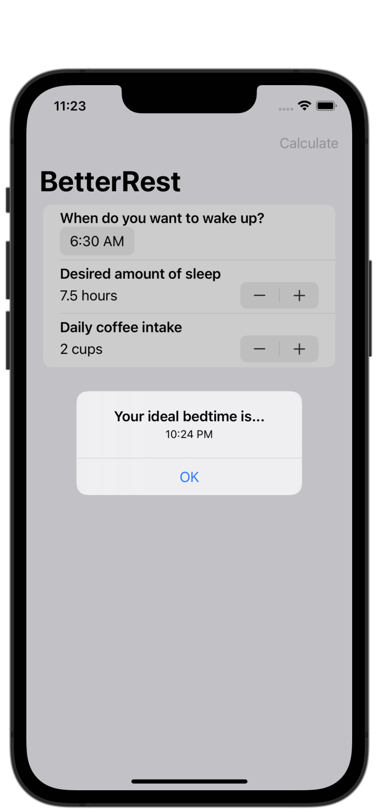
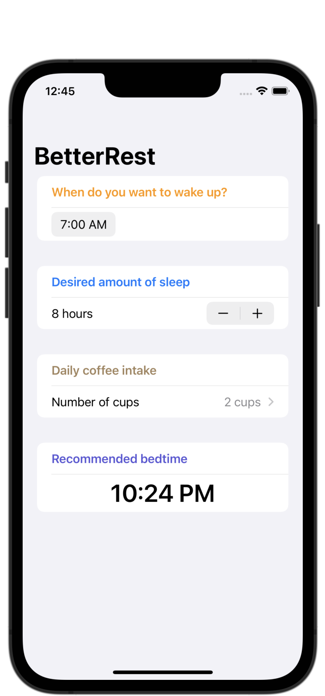

#  Project 4 - BetterRest

[Day 26 - BetterRest Part One](https://www.hackingwithswift.com/100/swiftui/26)

[Day 27 - BetterRest Part Two](https://www.hackingwithswift.com/100/swiftui/27)

[Day 28 - BetterRest Part Three](https://www.hackingwithswift.com/100/swiftui/28)

## Topics

* Stepper
* DatePicker
* Date, Calendar, DateComponents
* Create ML, Core ML

## Challenges

1. Replace each `VStack` in our form with a `Section`, where the text view is the title of the section. Do you prefer this layout or the `VStack` layout? It's your app - you choose! **I prefer the look of `Sections` rather than `VStacks`, so I will be keeping it that way.**
2. Replace the “Number of cups” stepper with a `Picker` showing the same range of values.
3. Change the user interface so that it always shows their recommended bedtime using a nice and large font. You should be able to remove the “Calculate” button entirely.

## Screenshots

### Base app

    
    

### Challenges

    
    

