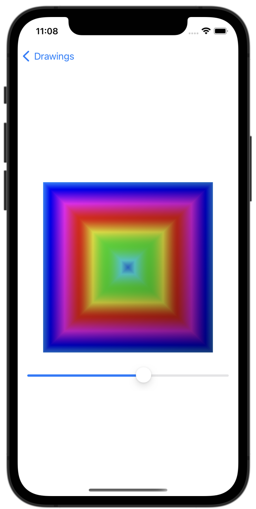

#  Project 9 - Drawing

[Day 43 - Drawing Part One](https://www.hackingwithswift.com/100/swiftui/43)

[Day 44 - Drawing Part Two](https://www.hackingwithswift.com/100/swiftui/44)

[Day 45 - Drawing Part Three](https://www.hackingwithswift.com/100/swiftui/45)

[Day 46 - Drawing Part Four](https://www.hackingwithswift.com/100/swiftui/46)

## Topics

* Paths, shapes, insettable shapes
* CGAffineTransform
* ImagePaint
* drawingGroup()
* Blend modes
* animatableData
* AnimatablePair

## Challenges

1. Create an `Arrow` shape - having it point straight up is fine. This could be a rectangle/triangle-style arrow, or perhaps three lines, or maybe something else depending on what kind of arrow you want to draw.
2. Make the line thickness of your `Arrow` shape animatable.
3. Create a `ColorCyclingRectangle` shape that is the rectangular cousin of `ColorCyclingCircle`, allowing us to control the position of the gradient using one or more properties. 

## Screenshots

### Challenges 1 & 2

    
    

### Challenge 3

    

