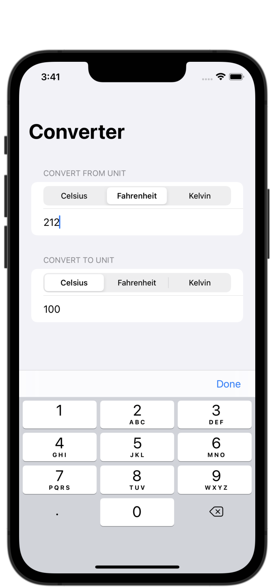
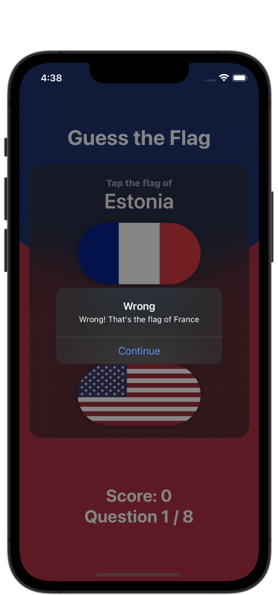
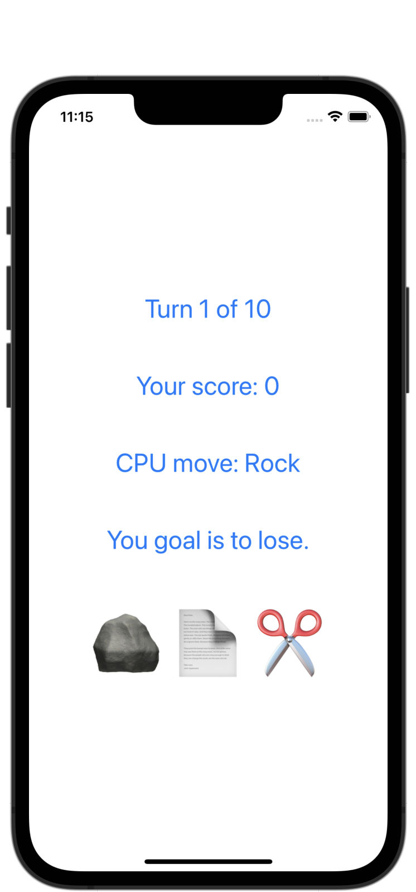

# 100 Days of SwiftUI
My solutions to Paul Hudson's course called, "100 Days of SwiftUI." I include my solutions to checkpoints and challenges, along with a list of topics and screenshots.

https://www.hackingwithswift.com/100/swiftui

I am posting status updates to my Twitter each week; find that here: https://twitter.com/landoncayia

## Progress
| Type           | Amount | Completed % |
| :---           | :---:  |    :---:    |
| Checkpoints    | 9 /  9 |    100%     |
| Projects       | 3 / 19 |   15.8%     |
| Milestones     | 1 /  6 |   16.7%     |
| Challenge Days | 1 /  1 |    100%     |

## Projects

| Project | Topics | Screenshots |
| :-- | :-- | :-- |
| Project 1: WeSplit | Form, NavigationView, @State, Section, Picker, TextField, ForEach | 
   
 |
| Challenge Day: Converter | *No new topics* | 
   
 |
| Project 2: Guess the Flag | Stacks, Colors, Frames, Gradients, Buttons, Images, Alerts | 
    
 |
| Project 3: Views and Modifiers | SwiftUI inner workings, Views, Modifiers, Conditional modifiers, Environment modifiers, Views as properties, View composition, Custom modifiers | 
  
 |
| Milestone Project 1: Rock Paper Scissors Brain Game | Review of topics covered so far | 
  
 |
