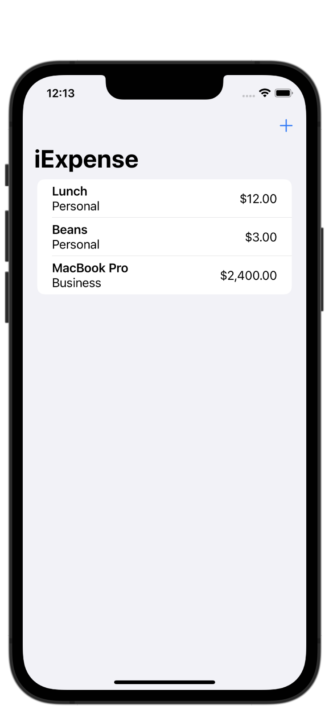

# 100 Days of SwiftUI
My solutions to Paul Hudson's course called, "100 Days of SwiftUI." I include my solutions to checkpoints and challenges, along with a list of topics and screenshots.

https://www.hackingwithswift.com/100/swiftui

I am posting status updates to my Twitter each week; find that here: https://twitter.com/landoncayia

I am also logging my accomplishments, struggles, and impressions in my log file. You can find that here: [swiftui-log.md](swiftui-log.md)

## Progress
| Type           | Amount | Completed % |
| :---           | :---:  |    :---:    |
| Checkpoints    | 9 /  9 |    100%     |
| Projects       | 9 / 19 |   47.4%     |
| Milestones     | 3 /  6 |   50.0%     |
| Challenge Days | 1 /  1 |    100%     |

*Update 7/25/2022: I took a short break for personal reasons, but I am back and ready to begin learning again!*

## Projects

| Project | Topics | Screenshots |
| :-- | :-- | :-- |
| Project 1: WeSplit | Form, NavigationView, @State, Section, Picker, TextField, ForEach | 
  
 |
| Challenge Day: Converter | *No new topics* | 
  
 |
| Project 2: Guess the Flag | Stacks, Colors, Frames, Gradients, Buttons, Images, Alerts | 
  
 |
| Project 3: Views and Modifiers | SwiftUI inner workings, Views, Modifiers, Conditional modifiers, Environment modifiers, Views as properties, View composition, Custom modifiers | 
  
 |
| Milestone Project 1: Rock Paper Scissors Brain Game | Review of topics covered so far | 
  
 |
| Project 4: BetterRest | Stepper, DatePicker, Date, Calendar, DateComponents, Create ML, Core ML | 
  
 |
| Project 5: WordScramble | List, UITextChecker, onAppear(), Bundle, fatalError(), More practice with @State, NavigationView | 
  
 |
| Project 6: Animations | Implicit and explicit animations, binding animations, gesture animations, transitions | |
| Milestone Project 2: Multiplication Tables Kids' Game | Review of topics covered so far | 
  
 |
| Project 7: iExpense | UserDefaults, Codable, sheet(), onDelete(), @StateObject, @ObservedObject, @Environment | 
  
 |
| Project 8: Moonshot | NavigationLink, GeometryReader, ScrollView, Codable, Resizing images, Grid layouts | 
  
 |
| Project 9: Drawing | Paths, shapes, insettable shapes, CGAffineTransform, ImagePaint, drawingGroup(), Blend modes, animatableData, AnimatablePair | 
  
 |
| Milestone Project 3: Habit Tracker | Review of topics covered so far | Screenshots coming soon. |
